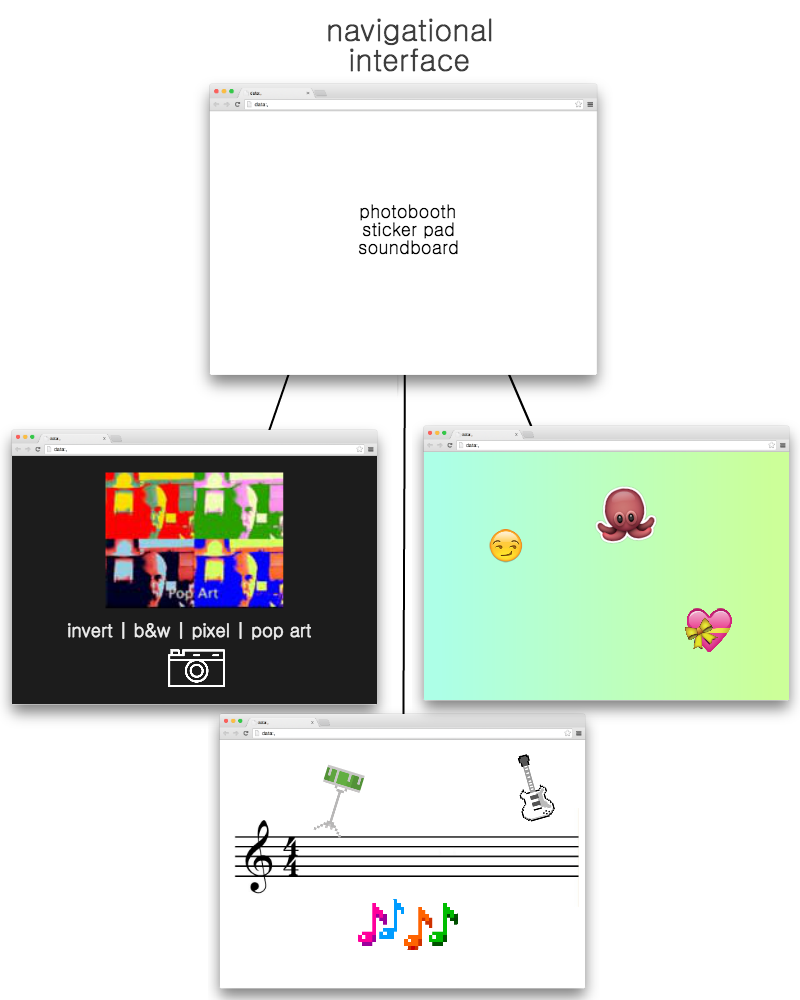

# Drawing on the Web
## Final Project
### Outline

The first interactive web page will be a photo booth of sorts, in which the camera device is projected in the browser. The user will have the option to overlay various camera filters such as inverted colors, a pointillism effect, mirroring, and color tints by clicking on buttons displayed on the page. In addition, by pressing ‘S’ on the keyboard the user can save a screenshot of their photo to their desktop.

The second page will be a sticker drawing board. The user can select a custom background color or generate a random gradient. They can then choose one of several different emoji stickers to ‘paint’ with, with the mouse acting as the brush when the user presses down. Once again, the user will have the option to press ‘S’ to save a snapshot of the canvas drawing to their desktop.

The third and final page will be an interactive musical experience, similar to a sound board. Various clickable elements will be placed on the canvas which, when pressed, play a particular note or beat. The user can trigger different sounds to create their own music piece. 

This project will involve P5, as well as various CSS3 transition effects. 

### Wireframes / Site Map

